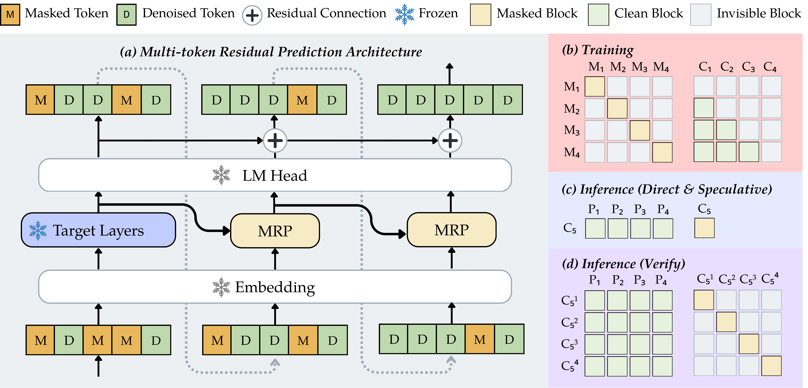

<div align="center">


[](https://arxiv.org/abs/XXXX.XXXXX)
[](https://huggingface.co/collections/heavyball/sdar-mrp)
[](https://github.com/heavyball-research/sglang)

</div>

**Multi-token Residual Prediction (MRP)** is a 
lightweight draft module that learns to predict several future denoising steps from a single target-model forward pass, enabling speculative-style decoding that yields the same outputs with substantially fewer target-model calls.

<p align="center">
  
</p>

---

## Installation

Training:

```bash
conda create -n llamafactory_sdar python=3.11 -y
conda activate llamafactory_sdar
pip install torch==2.8.0+cu128 torchvision==0.23.0+cu128 torchaudio==2.8.0+cu128 --index-url https://download.pytorch.org/whl/cu128
pip install --no-build-isolation flash-attn==2.8.3

cd src/training/sdar/llama_factory_sdar
pip install -e .
```

Evaluation:

```bash
conda create -n opencompass python=3.10 -y
conda activate opencompass
pip install torch==2.7.1+cu128 torchaudio==2.7.1+cu128 torchvision==0.22.1+cu128 --index-url https://download.pytorch.org/whl/cu128
pip install --no-build-isolation flash-attn==2.8.3

pip install -r src/eval/requirements.txt
cd src/eval/opencompass
pip install -e .
```


If the prebuilt flash-attn wheel does not work on your machine, build flash-attn from source on a GPU node.

## Common Commands

Train:

```bash
conda activate llamafactory_sdar
NUM_GPUS=8 bash scripts/train_sdar_mrp.sh
```

Evaluate:

```bash
conda activate opencompass
NUM_GPUS=1 bash scripts/eval_opencompass_hf.sh
```

Test generation:

```bash
conda activate opencompass
python scripts/test_generation.py
```

## Pretrained Models

We release MRP-trained checkpoints under [`heavyball/SDAR-MRP`](https://huggingface.co/collections/heavyball/sdar-mrp) at two scales (1.7B, 4B, 8B), each in three variants:

| Variant | Repo suffix | Training |
| --- | --- | --- |
| **default** | `sdar-{1.7b,4b,8b}-mrp-3lyr` | 1 MRP step with the residual objective. The standard recipe — start here. |
| **k2** | `sdar-{1.7b,4b,8b}-mrp-3lyr-k2` | 2 MRP steps with the residual objective. Better when running inference with `mrp_steps >= 2`. |
| **direct** | `sdar-{1.7b,4b,8b}-mrp-3lyr-direct` | 1 MRP step, no residual objective (the head predicts the future logits directly instead of a residual). Ablation baseline. |

Pass any of these IDs as `MODEL_PATH=` to the train/eval scripts, or as `model_path` in `scripts/test_generation.py`.

## Citation

If you find this repository helpful, please consider citing:

```bibtex
@article{xu2026mrp,
    title     = {Multi-Token Residual Prediction},
    author    = {Xu, Yufeng and Bao, Zishuo and Wang, Qian and Zhang, Zeshen and Zhang, Haoqi and Peng, Bowen and Li, Ang and Chalamala, Rahul and Lu, Yucheng},
    journal   = {arXiv preprint arXiv:XXXX.XXXXX},
    year      = {2026}
}
```

## License

This project is licensed under the MIT License - see the [LICENSE](LICENSE) file for details.